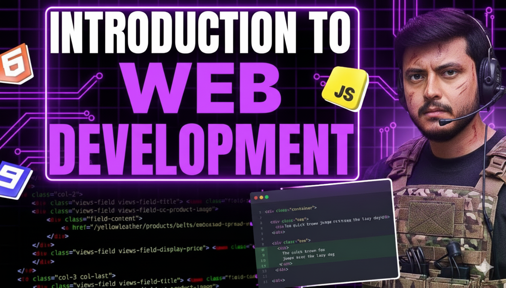

# strike-landing-Page
# ⚡ Strike - Landing Page

**Strike** is a modern and responsive **course selling website landing page** built using **HTML and CSS**.  
It’s designed to showcase courses, features, and achievements in a clean and professional layout.

---

## 🌐 Live Preview

🚀 **Preview Link:** [Add your Netlify or GitHub Pages link here]  

(You can replace the above line once you deploy it.)

## 🗂️ Project Folder Structure

strike/
│
├── strikepage.html # Main HTML file
├── strikepage.css # Stylesheet for the landing page
│
├── dsaPaid.png # Course/feature images
├── genai_is.png
├── HLD.png
├── instagram.svg
├── linkedin.svg
├── linkedin-svgrepo-com.svg
├── web_course.png
├── webdev.png
├── White_logo.png
├── x.svg
├── youtube.svg

---

## 💻 Tech Stack

- **HTML5**
- **CSS3**
- **Font Awesome Icons** (via CDN)

---

## ✨ Features / Sections

- 🧭 Responsive Navigation Bar  
- 🎯 Hero Section with call-to-action  
- 📚 Courses / Features Section  
- 🏆 Achievements Section  
- 👣 Footer with Social Links  

---

## 🚀 How to Run Locally

Just open strikepage.html in your browser.

👨‍💻 Author
Krishna Pratap Singh
🔗 [LinkedIn Profile](https://www.linkedin.com/in/krishna-pratap-singh-471354381?utm_source=share&utm_campaign=share_via&utm_content=profile&utm_medium=android_app)

